# *FlashWrite*: An Embedded Journaling System Backed by an Emulated EEPROM
*Designed & Implemented by Sai Vura (ECE student @ Purdue University) as a Personal Project*

## <u>Abstract</u>
The “FlashWrite” is a secure, password-protected, embedded journaling system built on an STM32 microcontroller platform. It allows users to create, store, read, view, and delete diary entries through a serial terminal interface. All data is saved to the EEPROM memory. Very simple encryption and decryption methods have been implemented for safe storage and retrieval of data into the memory of the microcontroller. Designed with limited hardware, this project emphasizes efficient memory usage, real-time input handling, and a modular firmware development. This diary serves as both a practical tool and an educational demo of embedded systems design.


## <u>Features / Demo</u>
1. System will greet users and ask them to input their password.
<br>

</br>
2. Users have 3 attempts to enter the correct password.
<br>
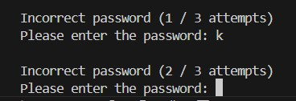
</br>
3. If maxed out on attempts, the system locks.
<br>
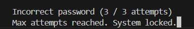
</br>
4. Once correct password is input, users can enter the "write," "search," "read," "list," "delete," or "logout" commands.
<br>
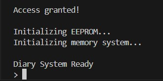
</br>
5. In case of any invalid commands, a list of valid commands will be shown.
<br>
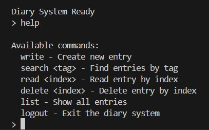
</br>
6. The "write" command will enable them to make a new diary entry. They will be asked to enter a tag and the content.
<br>
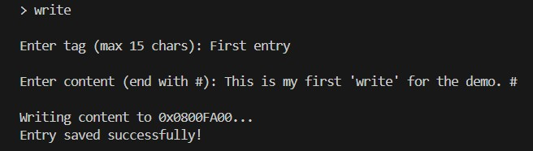
</br>
7. Users can make multiple entries.
<br>
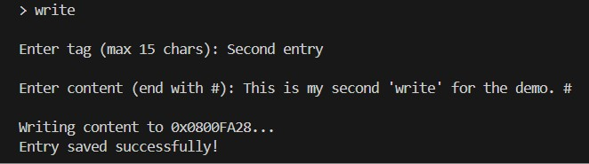
</br>
8. The "search" command will allow them to search for a certain entry based on the tagline. Details of the entry will be displayed.
<br>
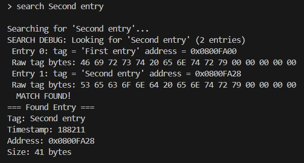
</br>
9. If search does not match any entry, the following message will be displayed.
<br>
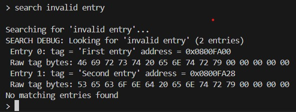
</br>
10. Users can read the specified entry with the "read" command.
<br>
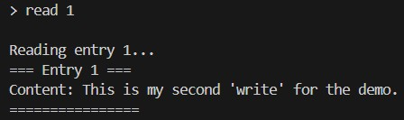
</br>
11. Users can get a complete list of entries with the "list" command.
<br>
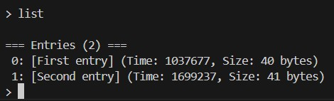
</br>
12. Users can delete a specific entry with the "delete" command.
<br>

</br>
13. When complete, users must enter the "logout" command to close the system.
<br>
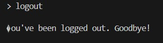
</br>


## <u>System Overview</u>
- **Block Diagram of System Flow**
<br>

</br>

- **Schematic of Hardware Components**
<br>
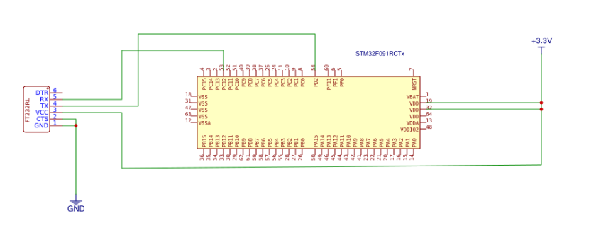
</br>


## <u>System Architecture</u>
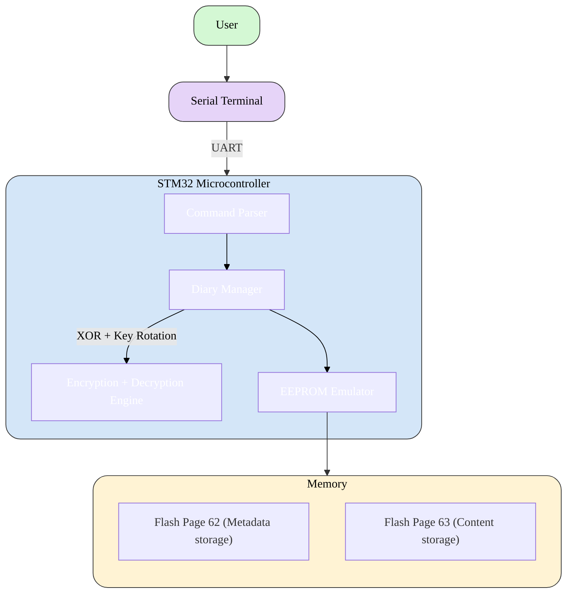

## <u>Memory Management</u>
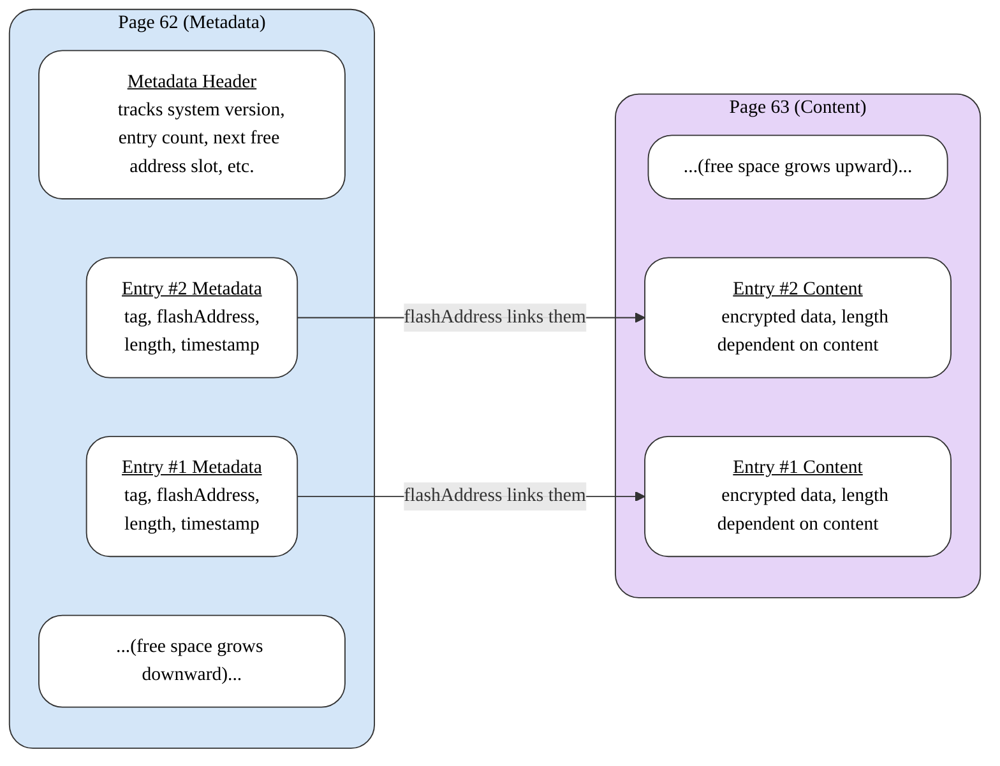


## <u>Implementation Details</u>
### High Level Overview of Modules
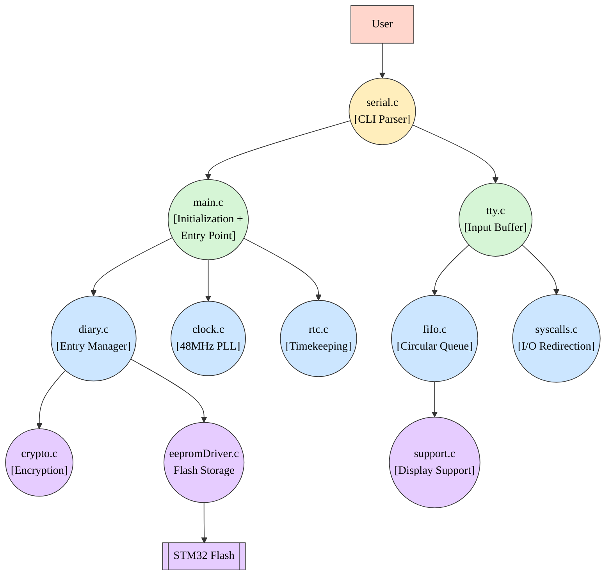

### Modules Explained
1. ```main.c```: The entry point for the application + initializes the hardware
2. ```clock.c```: Configures the internal clock system, enabling the PLL for a 48 MHz system clock
3. ```crypto.c```: Implements simple XOR encryption/decryption 
4. ```diary.c```: Manages diary entries in EEPROM, handling storage and retrieval
5. ```eepromDriver.c```: Low-level driver for the EEPROM emulation on the STM32 flash memory
6. ```fifo.c```: Implements a circular buffer for data handling and supports insertion and removal and newline detection
7. ```rtc.c```: Simulates a real-time clock using SysTick for timestamp generation in each entry
8. ```serial.c```: Handles user commands via UART I/O
9. ```syscalls.c```: Minimal system call implementations to enable standard I/O
10. ```tty.c```: Manages UART input buffering and line editing
11. ```support.c```: Provides low-level hardware and timing functions for the user interface


## <u>Bugs + Testing</u>

### Frequent Bugs Encountered:
- Flash Write Failures
- Corruption of Metadata
- FIFO Overflow
- Encryption/Decryption Mismatch
- Serial Input Issues
- Corrupted Reads After Deletion
- Timing Sensitivity

### Testing Strategies:
To ensure the reliability of the system, several testing approaches were used, covering functionality, error handling, and edge conditions. Key strategies included:
- **Unit Testing**: Verified individual modules in isolation using debug logs and tested edge cases. Wrote several helper functions to test accurate terminal output, input parsing, proper timestamping, valid data retreival, correct decryption, etc.
- **Integration Testing**: Validated interactions between each module and confirmed appropriate responses and outputs with several sessions of isolated testing.
- **Hardware Validation**: Simulated dozens of frequent writes and deletions in a short timespan to fix any timing issues and verified if RTC timestamps matched the creation times of the entries by making use of custom CLI commands and the STM32 debugger.


## <u>Tools + Datasheets</u>
The following parts were used to implement the project:
- **STM32 MCU**: https://www.technologicalarts.com/collections/student-quickbuy/products/stm32f091-dev-board 
    - Datasheets:
        - https://www.st.com/resource/en/datasheet/stm32f091cc.pdf 
        - https://www.st.com/resource/en/reference_manual/rm0091-stm32f0x1stm32f0x2stm32f0x8-advanced-armbased-32bit-mcus-stmicroelectronics.pdf  

- **ST-Link USB**: https://www.technologicalarts.com/collections/student-quickbuy/products/st-link-v2 

- **USB → UART adapter**: https://www.amazon.com/IZOKEE-CP2102-Converter-Adapter-Downloader/dp/B07D6LLX19/ref=sr_1_3?keywords=usb+to+uart+converter&qid=1691590455&sr=8-3 

- **VSCode + PlatformIO**:
    - https://code.visualstudio.com/
    - https://platformio.org/install/ide?install=vscode 
